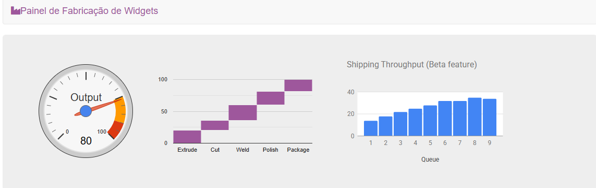

<div align="center">

# 🛠️ Lab 169 — Utilizando o AWS Systems Manager


</div>

---

## 📌 Sobre o laboratório

O **AWS Systems Manager** é um conjunto de funcionalidades usado para **centralizar dados operacionais** e **automatizar tarefas** em recursos da AWS. Ele permite configurar e gerenciar instâncias EC2, servidores locais, máquinas virtuais e outros recursos em escala — tudo a partir de um único lugar.

> 💡 **Cenário:** usar o Systems Manager para inventariar instâncias, instalar uma aplicação remotamente, gerenciar configurações de forma centralizada e acessar uma instância **sem precisar de SSH**.

---

## 🎯 Objetivos

Ao concluir este laboratório, fui capaz de usar o Systems Manager para:

- ✅ Verificar **configurações e permissões**
- 🖥️ Executar **tarefas em vários servidores**
- ⚙️ Atualizar **configurações ou definições** da aplicação
- 💻 Acessar a **linha de comando** em uma instância

---

## 🗺️ Fluxo do laboratório

```
                        🛠️  AWS Systems Manager
        ┌────────────────────────────────────────────────────┐
        │                                                      │
        │  1️⃣ Fleet Manager                                    │
        │     📋 Inventário de instâncias gerenciadas          │
        │                                                      │
        │  2️⃣ Run Command                                      │
        │     🚀 Instala app remotamente, sem acesso manual     │
        │                                                      │
        │  3️⃣ Parameter Store                                  │
        │     🔐 Configurações e segredos centralizados         │
        │                                                      │
        │  4️⃣ Session Manager                                  │
        │     🔑 Shell seguro, sem SSH, sem portas abertas       │
        │                                                      │
        └────────────────────────────────────────────────────┘
                              │
                              ▼
                     🖥️ Instância(s) EC2
```

---

## 🛠️ Etapas realizadas

### ✅ Tarefa 1 — Gerar listas de inventário para instâncias gerenciadas

Uso do **Fleet Manager**, recurso do Systems Manager, para coletar informações do sistema operacional, aplicações e metadados de instâncias EC2 — permitindo entender rapidamente quais instâncias estão de acordo com as políticas de software definidas e quais precisam de atualização.


### ✅ Tarefa 2 — Instalar um aplicativo personalizado usando o comando Executar

Instalação remota de um aplicativo web personalizado — o **Painel de Controle de Fabricação de Widgets** — utilizando o **Run Command (comando Executar)**, sem a necessidade de acessar manualmente a instância.

```bash
aws ssm send-command \
  --document-name "InstallDashboardApp-qae0buvw37CX" \
  --document-version "1" \
  --targets '[{"Key":"InstanceIds","Values":["i-0336c037e9c4fa13b"]}]' \
  --parameters '{}' \
  --timeout-seconds 600 \
  --max-concurrency "50" \
  --max-errors "0" \
  --region us-west-2
```

📊 **Resultado:** painel funcional exibindo métricas simuladas de produção (Output, etapas de fabricação — Extrude, Cut, Weld, Polish, Package — e throughput de envio).

### ✅ Tarefa 3 — Usar o Parameter Store para gerenciar as configurações do aplicativo

Uso do **Parameter Store** para armazenar, de forma segura e hierárquica, um parâmetro de configuração usado para ativar um recurso dentro da aplicação — demonstrando como centralizar senhas, strings de conexão e configurações sem expô-las no código.

### ✅ Tarefa 4 — Usar o Gerenciador de Sessões para acessar instâncias

Acesso à instância EC2 por meio do **Session Manager**, via shell interativo baseado em navegador — **sem abrir portas de entrada, sem host bastion e sem gerenciar chaves SSH**, mantendo logs totalmente auditáveis do acesso.


---

## ✅ Resultado final

Instância gerenciada de ponta a ponta pelo **AWS Systems Manager**: inventariada, configurada remotamente, com parâmetros centralizados e acessível de forma segura — tudo sem abrir uma única porta SSH. 🎉


---

## 🧠 Principais aprendizados

- 🔹 Como obter **visibilidade de inventário** sobre uma frota de instâncias com o Fleet Manager
- 🔹 Execução remota de comandos em escala com o **Run Command**
- 🔹 Centralização segura de configurações e segredos com o **Parameter Store**
- 🔹 Acesso seguro e auditável a instâncias com o **Session Manager**, eliminando a necessidade de SSH tradicional
- 🔹 Como o Systems Manager reduz a superfície de ataque ao evitar portas de entrada abertas

---

## 🏷️ Tecnologias e Serviços


---

<div align="center">

📚 *Laboratório prático realizado como parte da trilha de estudos em Computação em Nuvem, com foco em transição de carreira para Engenharia de Dados.*

</div>

